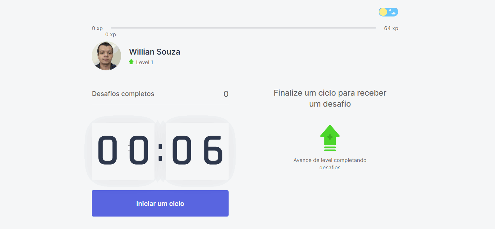
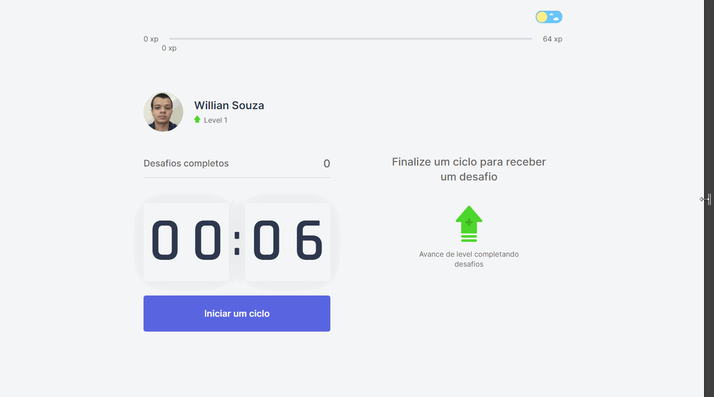
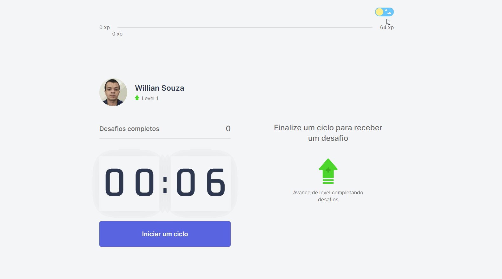

<h1 align="center">
    
<h1>
<h1>
    
    <h3 align="center"> 
        Access the application here 👉 <a href="https://moveit-qyq8n4sli-willian-souza.vercel.app/" target="_blank">move.it<a>
    <h3>
<h1>


<h1 align = "center">
    <a href="https://www.linkedin.com/in/willian-ssouza/">
        
    </a>
    <a href="https://github.com/willian-souza/rocketseat-site/blob/master/LICENSE">
        
    </a>


# 📋 Index
- [About](#-about)
- [Technologies used](#-technologies-used)
- [Download and run the project ](#-download-and-run-the-project)
- [License](#-license)

---

# 📄 About
The move.it consists of an application based on the Pomodoro Technique. This technique is a time management method that consists of using a stopwatch to divide the work/study into periods of 25 minutes, separated by brief intervals. Thus, in our application, every 25 minutes the user is given a challenge to execute.
- The challenge is drawn through a pre-defined list of exercises.
- This list contains stretching exercises and exercises for the eyes.
- Each challenge has an amount of XP that the user earns when completing the challenge, and the user will level up as he completes the challenges.
- The user only receives a challenge if he completes the 25 minutes of study/work (does not have the option to pause).That is, if he abandons the cycle, for whatever reason, before its end, the timer returns to the initial state.

This application was developed during the **Rocketseat Next Level Week 4**.

But i added some features:

- Responsiveness



- Dark Mode
    

---

# 🖥 Technologies used
- [ReactJS](https://reactjs.org/)
- [NextJS](https://nextjs.org/)
- [Typescript](https://www.typescriptlang.org/)

---

# 📦 Download and run the project

Note: To perform the procedures below on your terminal it is necessary to have [Git](https://git-scm.com/downloads) and [NodeJS](https://nodejs.org/en/) or [Yarn](https://yarnpkg.com/)  installed on the machine.

### - With npm
```bash

    # Clone the repository
    $ git clone https://github.com/willian-souza/moveit

    # Enter the downloaded directory
    $ cd moveit

    # Install all dependencies        
    $ npm install 

    # Run the application
    $ npm run dev

```
### - With yarn
```bash

    # Clone the repository
    $ git clone https://github.com/willian-souza/moveit

    # Enter the downloaded directory
    $ cd moveit

    # Install all dependencies        
    $ yarn

    # Run the application
    $ yarn dev

```
Open [http://localhost:3000](http://localhost:3000) with your browser to see the result.

---

# 📝License
This project is under license MIT. See the archive [LICENSE](/LICENSE) for more details.

---

Developed by [Willian dos Santos Souza](https://www.linkedin.com/in/willian-ssouza/)


